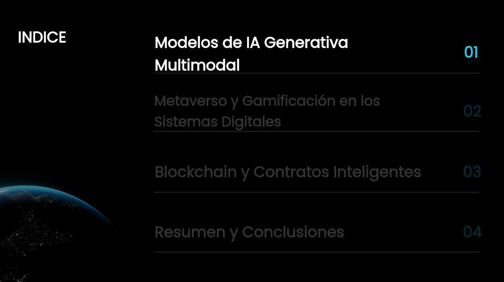
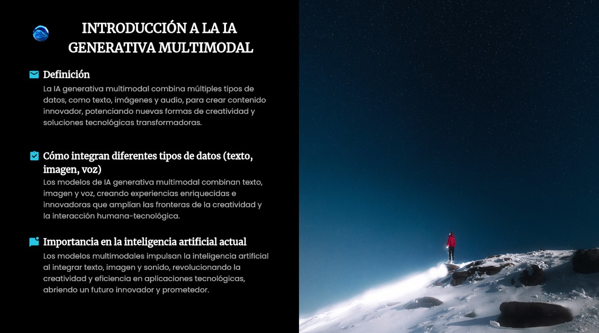
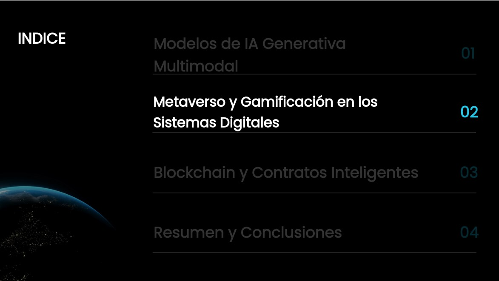
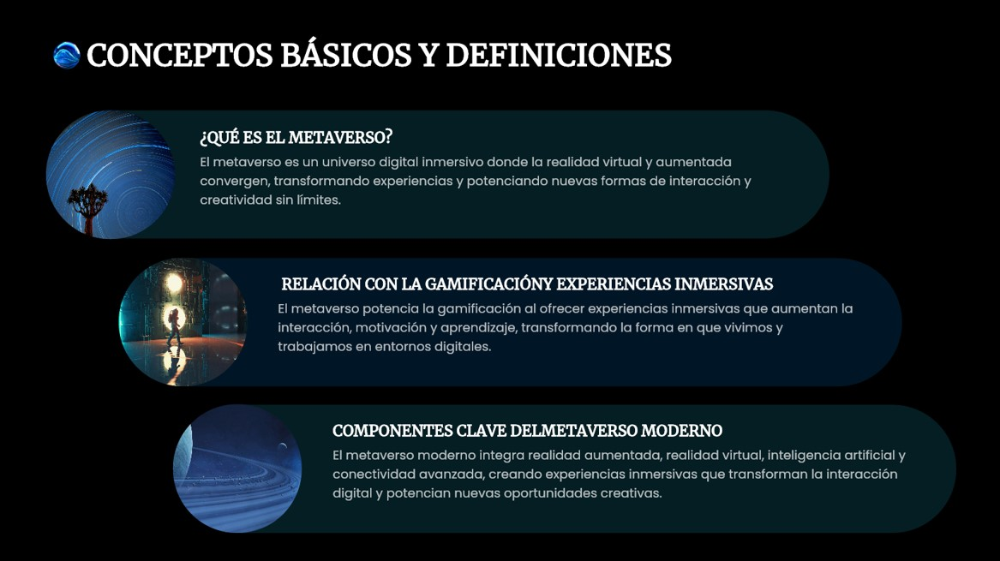
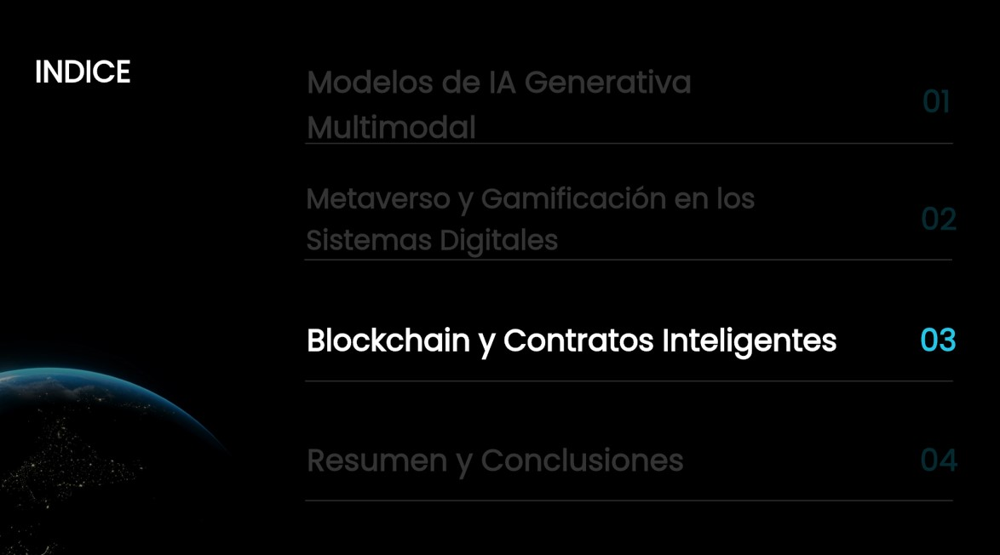
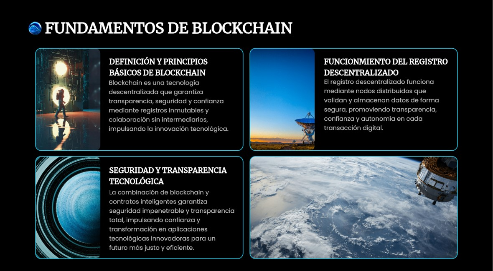

# Laboratorio con Pepper, Chatbot y Dashboard

Este repositorio contiene:
- Código de Pepper para la exposición.
- Chatbot educativo.
- Dashboard en Streamlit.
- Documento en Overleaf.
---

## Primer Punto: Interactuando con Pepper
### Paso a paso
### 1. Configuración
1. Conectar Pepper a la red y obtener su **IP**.  
2. Instalar Python con el SDK de NAOqi.  
3. Subir las diapositivas a la carpeta multimedia del robot o un servidor.  

### 2. Ejecutar
1. Guardar el script como `pepper_expo.py`.  
2. Cambiar la IP en el código:  
   ```python
   connection_url = "tcp://<IP_PEPPER>:9559"
Ejecutar:
```
python pepper_expo.py
```
### Imágenes de las diapositivas
Coloca tus imágenes en la carpeta images/ y cámbialas en el código:

```
tablet.showImage("http://198.18.0.1/apps/multimedia/diapositiva1.png")
```
### Ejemplo de estructura:
images/
 ├─ diapositiva1.png
 ├─ diapositiva2.png
 ├─ diapositiva3.png
 ├─ diapositiva4.png
 ├─ diapositiva5.png
### Código usado
```
import qi
import time
import sys

def main(session):
    tts = session.service("ALTextToSpeech")
    motion = session.service("ALMotion")
    posture = session.service("ALRobotPosture")
    tablet = session.service("ALTabletService")

    posture.goToPosture("StandInit", 0.5)
    tts.setLanguage("Spanish")
    tts.setVolume(0.9)

    # INTRODUCCIÓN
    tablet.showImage("http://198.18.0.1/apps/multimedia/diapositiva1.png")
    tts.say("Hola a todos. Hoy quiero presentarles tres innovaciones que están transformando los sistemas digitales.")
    motion.setAngles("RShoulderPitch", -0.5, 0.2)
    motion.setAngles("RElbowYaw", 1.5, 0.2)
    motion.setAngles("RElbowRoll", 0.5, 0.2)
    time.sleep(3)
    motion.setAngles("RShoulderPitch", 1.5, 0.2)

    # --- PRIMER TEMA: INTELIGENCIA ARTIFICIAL GENERATIVA ---
    tablet.showImage("http://198.18.0.1/apps/multimedia/diapositiva2.png")
    tts.say("En primer lugar, los modelos de inteligencia artificial generativa multimodal integran texto, imágenes, voz y video, creando contenidos innovadores y realistas.")
    time.sleep(5)

    tablet.showImage("http://198.18.0.1/apps/multimedia/diapositiva2b.png")
    tts.say("Estos modelos ya se aplican en la educación, el arte y la investigación científica, optimizando procesos y reduciendo tiempos de desarrollo.")
    motion.setAngles("HeadYaw", 0.3, 0.2)
    time.sleep(2)
    motion.setAngles("HeadYaw", -0.3, 0.2)
    motion.setAngles("HeadYaw", 0.0, 0.2)

    # --- SEGUNDO TEMA: METAVERSO Y GAMIFICACIÓN ---
    tablet.showImage("http://198.18.0.1/apps/multimedia/diapositiva3.png")
    tts.say("En segundo lugar, el metaverso y la gamificación permiten experiencias inmersivas en entornos virtuales, cambiando la forma en que aprendemos, trabajamos y jugamos.")
    time.sleep(6)

    tablet.showImage("http://198.18.0.1/apps/multimedia/diapositiva3b.png")
    tts.say("Las aulas virtuales, las simulaciones empresariales y los videojuegos educativos ya son una realidad, generando motivación y aprendizaje más efectivo.")
    motion.setAngles("LShoulderPitch", -0.3, 0.2)
    motion.setAngles("RShoulderPitch", -0.3, 0.2)
    time.sleep(3)
    motion.setAngles("LShoulderPitch", 1.2, 0.2)
    motion.setAngles("RShoulderPitch", 1.2, 0.2)

    # --- TERCER TEMA: BLOCKCHAIN Y CONTRATOS INTELIGENTES ---
    tablet.showImage("http://198.18.0.1/apps/multimedia/diapositiva4.png")
    tts.say("Finalmente, blockchain y los contratos inteligentes permiten transacciones seguras y descentralizadas, eliminando intermediarios y garantizando confianza en procesos digitales.")
    time.sleep(6)

    tablet.showImage("http://198.18.0.1/apps/multimedia/diapositiva4b.png")
    tts.say("Estas tecnologías ya se utilizan en sistemas financieros, cadenas de suministro y administración pública, aportando transparencia y eficiencia.")
    motion.setAngles("HeadPitch", 0.3, 0.2)
    time.sleep(2)
    motion.setAngles("HeadPitch", 0.0, 0.2)

    # CIERRE
    tablet.showImage("http://198.18.0.1/apps/multimedia/diapositiva5.png")
    tts.say("Estas innovaciones marcan el futuro de la tecnología digital. Muchas gracias por su atención.")
    tablet.hideImage()

if __name__ == "__main__":
    try:
        connection_url = "tcp://198.18.0.1:9559"
        app = qi.Application(["PepperTalk", "--qi-url=" + connection_url])
        app.start()
        session = app.session
        main(session)
    except RuntimeError:
        print("No se pudo conectar con Pepper.")

```
### Diapositivas mostradas:
 
 
 
 
 
 
 

## Segundo Punto: Chatbot
Paso a paso
bash
```
pip install chatterbot chatterbot_corpus pyttsx3
python scripts/chatbot.py
```

python
```
from chatterbot import ChatBot
from chatterbot.trainers import ListTrainer
import pyttsx3

chatbot = ChatBot("PepperChat")
trainer = ListTrainer(chatbot)
trainer.train([
    "¿Qué es Blockchain?",
    "Es una red descentralizada de bloques seguros."
])
```
Evidencia:

## Tercer Punto: Dashboard
Paso a paso
bash
```
pip install streamlit
streamlit run scripts/dashboard.py
```
python
```
import streamlit as st
st.title("🤖 Dashboard Pepper + Chatbot + Videos")
st.subheader("Chatbot Educativo")
```
Evidencia:

## Instrucciones de ejecución

### 1. Ejecución de Pepper
```bash
python scripts/pepper_expo.py
```
### Chatbot
```bash
python scripts/chatbot.py
````
### Dashboard
```bash
streamlit run scripts/dashboard.py
````
Cuarto Punto: Documento en Overleaf
Este documento está en la carpeta /doc/ y contiene todos los pasos y evidencias.

Evidencia:


## Autores
- **Rodian Daniel Garay Peralta**  
- **Mariana Lombana Rojas**

Docente: *Diego Alejandro Barragán Vargas*  
Universidad Santo Tomás  
5 de septiembre de 2025


